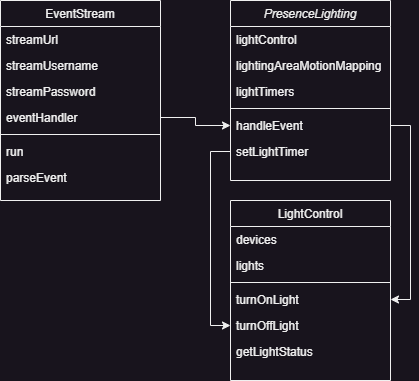

# Lightsy

Lightsy is a Python-based project for controlling lights based on motion detection events. It uses a `LightControl`
class to manage individual lights and a `PresenceLighting` class to handle motion detection events and control the
lights accordingly. The `EventStream` class is used to listen for motion detection events from the DVR/NVR.

The project is designed to work with Hikvision cameras using the ISAPI event stream for motion detection events. It
controls lights using the [tinytuya](https://github.com/jasonacox/tinytuya) library for Tuya smart devices.



## Features

- Turn lights on and off based on motion detection events.
- Configure active times for lights to respond to motion.
- Set duration for lights to stay on after motion is detected.
- Map multiple cameras to multiple lights for presence lighting.

## Installation

1. Clone the repository:
    ```sh
    git clone https://github.com/ayshmnmm/lightsy.git
    cd lightsy
    ```

2. Install the required dependencies:
    ```sh
    pip install -r requirements.txt
    ```

3. Create a `.env` file in the `src` directory with the following content:
    ```dotenv
    ISAPI_EVENT_URL="http://192.168.x.y/ISAPI/Event/notification/alertStream"
    ISAPI_USERNAME="username"
    ISAPI_PASSWORD="password"
    ```

## Usage

1. Create a `config.py` file in the `src` directory or rename `config.example.py` to `config.py` and configure the
   devices, lights, and presence lighting mappings:
    ```python
    DEVICES = {
        'device1_name': {
            'ip': '192.168.x.y',
            'dev_id': 'device1_id',
            'local_key': 'device_local_key',
            'version': 3.0
        }
    }
   
   LIGHTS = {
         'light1_name': {
              'device': 'device1_name',  # device name from DEVICES
              'switch': 1  # switch id
         }
   }
   
   PRESENCE_LIGHTING_MAPPING = [
        {
            "channels": [1],  # camera channel ids
            "lights": [{
                "light": "light1_name",  # light name from LIGHTS
                "duration": 45,  # duration in seconds for light to stay on after motion is detected
                "activeTime": [(0, 800), (1600, 2400)]   # 24-hour format active times
            }]
        }
   ]
   ```

2. Run the main script:
    ```sh
    python src/main.py
    ```

## Configuration

- `config.py`: Contains the configuration for devices, lights, and presence lighting mappings.
- `.env`: Contains the environment variables for the ISAPI event stream URL, username, and password.

## Example

An example of handling a motion detection event:

```python
lc = LightControl(DEVICES, LIGHTS)
pl = PresenceLighting(lc, PRESENCE_LIGHTING_MAPPING)
test_event = {
    "eventType": "VMD",
    "channelID": 1,
    "dateTime": "1970-01-01T12:00:00",
    # ...
}
pl.handle_event(test_event)
```

## License

Distributed under the MIT License. See `LICENSE` for more information.

## Contact

For any questions or feedback, please contact me at mail@ayushmanmuduli.com
